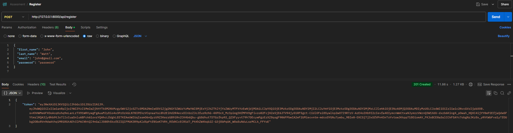
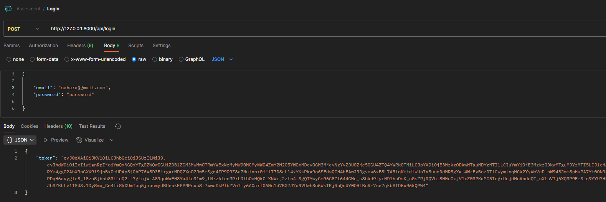
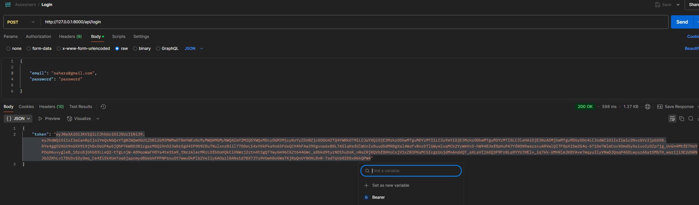
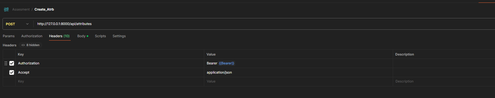
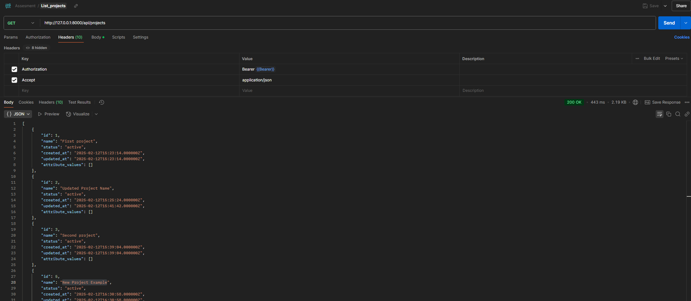

# laravel-assessment
This Laravel Assessment Project is a RESTful API that demonstrates robust project management features. It includes user authentication, project creation with dynamic attributes using an Entity-Attribute-Value (EAV) model, and timesheet tracking. The project also implements many-to-many relationships, allowing you to assign users to projects.

# Set up instructions
1. CLone the repository
`git clone https://github.com/Shahara98/laravel-assessment.git`
`cd laravel-assessment`

2. Install dependencies
`composer install`
`cp .env.example .env` //Update the .env file with database credentials

3. Generate application key
`php artisan key:generate` // key is already set, if it does not work, run this command
`php artisan migrate` // Run if needed

4. Import the attached `assessment.sql` dump file at `utils\assesment.sql`

5. Install Passport `php artisan passport:install`

6. Start the development server  `php artisan serve`

7. Open postman and import the collection `utils\Assesment.postman_collection.json`

8. API documentation can be found on `https://documenter.getpostman.com/view/19280892/2sAYXCidqo`

# Assumptions made
1. A time sheet for a task assigning a project and a user is only successful if the corresponding user is already added to the project using api/projects/{project_id}/users

# Technology used
1. php -> 8.0
2. laravel -> 9.19

# Test Credentials for login
"email": "sahara@gmail.com",
"password": "password"

# samples
1. Register new user

2. Login as a registered user

3. Save the token returned after registration or login to a variable 'Bearer', This token will be used for other crud operations of models.

4. For all the other apis to be authenticated, add the following headers as shown in the image

5. With provided header values provide the body data as per the requirement

